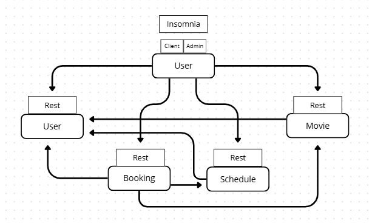

# UE-AD-A1-REST
TP de réalisation d'une application backend avec une architecture microservices en Python.
Ce projet permet de gérer la programmation et la réservation de films. 

## Services

Chaque service possède son propre fichier `README.md` dans son dossier respectif, cette section a pour objectif de les lister avec leur objectif.

- user : Gère le registre des utilisateurs et leurs permissions
- movie : Gère le catalogue de films et d'acteurs
- schedule : Gère les séances de visionnage 
- booking : Gère les réservations aux séances

Le schéma ci-dessous détaille les échange entre les différents services :



## Gestion des permissions

Un système de permissions a été mis en place dans le projet. Pour chaque utilisateur, un champ "admin" est présent dans la base de données pour connaître les permissions de chaque utilisateur. 

Pour chaque requête, il faut préciser le champ "authorization" de l'en-tête avec son userid. Les permissions sont ensuite vérifiées par la fonction authorization_is_admin() en faisant un appel au service user. 
Par défaut, si le champ n'est pas précisé, l'utilisateur n'aura pas les permissions de l'admin. 

Ainsi, tous les services font donc appel au service user. 

## Requirements

- Python
- Docker (if you want to run it inside a container)

## Docker

Le projet est entièrement dockerisé. Il est possible de choisir entre utiliser docker ou non. 

Si vous souhaitez utiliser docker, voici la commande à éxécuter: 
```sh
# Version JSON
docker compose -f docker-compose.yml up --build

# Version MongoDB
docker compose -f docker-compose-mongo.yml up --build
```

## MongoDB ou Json

Pour chaque service, il est possible de récupérer les données de la base soit avec MongoDB ou avec un fichier Json. Cette fonctionnalité a été implémentée à l'aide d'une interface commune pour la base de données, peu importe qu'elle soit importer avec MongoDB ou Json. 

Les détails des commandes pour utiliser soit l'un soit l'autre sont spécifiés dans les README de chaque service.

## Docker

Chaque service possède un Dockerfile permettant de le lancer dans un conteneur.

Par souci de practicité, deux fichiers permettent de lancer l'ensemble des services à l'aide de Docker Compose :
- `docker-compose.yml` : Les services utilisent chacun leur(s) fichiers json respectifs pour stocker les données
- `docker-compse-mongo.yml` : Les services utilisent une instance de MongoDB commune lancée dans un conteneur aux côtés des services

Pour démarrer les services :
```sh
# Version JSON
docker compose -f docker-compose.yml up --build

# Version MongoDB
docker compose -f docker-compose-mongo.yml up --build
``` 